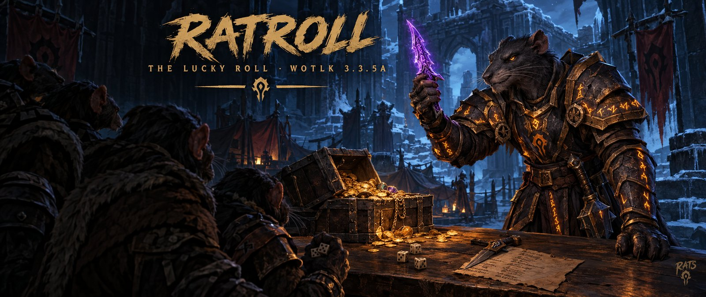
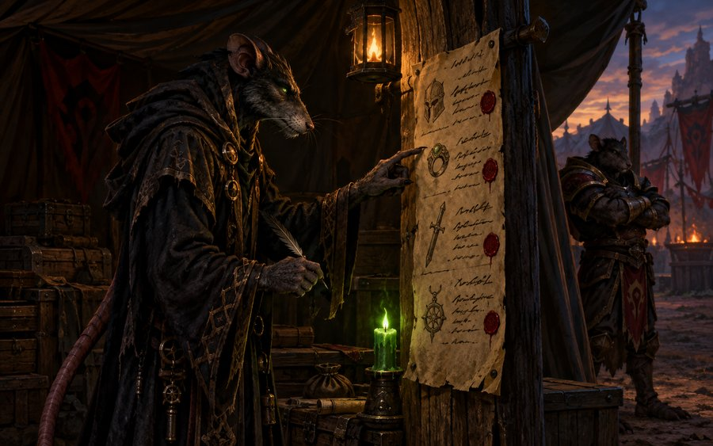

  

  <b>Loot rolls for World of Warcraft 3.3.5a.</b> 
  A small roll window, master loot in a click, and softres.it reserves. That's all it does.

  
  
  
  

---

<table>
<tr>
<td width="45%" valign="top">
  
</td>
<td valign="top">

### Why RatRoll

[Okanvil](https://github.com/MrNog/Okanvil) is the full raid toolkit: loot council, guild
pages, notes, PuG tools and more. A lot of raiders only want the part they use every boss: see
what dropped, roll on it, know who won.

RatRoll is that part on its own:

- **One small window.** What dropped, who rolled and who won, boss by boss.
- **Same code as Okanvil.** A raid can mix both: a master looter on Okanvil sees raiders on
  RatRoll, and the other way around.
- **Quiet.** No popups and no main window. It shows up when loot drops and closes when the boss
  is pulled.

</td>
</tr>
</table>

## Features

| | |
|---|---|
| **Roll window** | Opens when loot drops. One page per boss: each item with its quality color, who won it and how long it can still be traded. Click an item to see its rolls, best first. |
| **Your roll** | While a master-loot roll is open, **Roll MS (100)** and **Roll OS (99)** buttons do the `/roll` for you. Under group loot it shows the need/greed rolls with a timer bar. |
| **Master loot** | Pick an item, **Roll** (main or off spec) announces it, then **Give** hands it to the top roll. Click any roll to give it to someone else instead. |
| **Owed by trade** | An item master loot could not hand over stays marked in your bags with *trade to &lt;name&gt;* on its tooltip. Open a trade with the winner and it goes in the window by itself. |
| **Soft reserves** | The master looter pastes the CSV from softres.it. Each item shows who reserved it, and an MS roll on it only counts the reservers. The list goes to the raid by itself, so everyone sees the [SR] tags. |
| **Reserve list** | All reserved items by boss, with every reserver. Reservers not in the raid are greyed out, and each item shows whether it dropped tonight and who won it. |
| **Your list, your Clear** | The loot stays saved after you log off, so you can check the last raid later. **Clear** (two clicks) deletes your own list only. Nobody else's changes. |

## Soft reserves

  

1. On softres.it: **Export → CSV**, copy it.
2. In game, as master looter: open the roll window, click **SR**, then **CSV**, paste, **Import**.
3. That's it. The raid gets the list from you; nobody else has to paste anything.

## Install

1. Download [RatRoll.zip](https://github.com/MrNog/RatRoll/releases/latest/download/RatRoll.zip) (the latest release).
2. Put the **`RatRoll`** folder in `World of Warcraft\Interface\AddOns\`.
3. Restart the game.

Already using Okanvil? Then you have everything RatRoll does, and RatRoll switches itself off.

## Use

| | |
|---|---|
| `/rr` | open or close the roll window |
| `/rr stop` | end the open roll (master looter) |
| `/rrsr` | the soft reserve list (master looter) |
| `/rrtrade` | what you still owe by trade, and to whom |
| `/ratroll help` | all commands |

## Credits

Made by **Okanor** for the RATS guild. RatRoll is built from the loot part of
[Okanvil](https://github.com/MrNog/Okanvil). Soft reserves read the CSV from
[softres.it](https://softres.it).

## License

© 2026 Okanor. All rights reserved. Everyone is welcome to download RatRoll and play with it.
Publishing your own modified version or re-uploading it elsewhere needs the author's permission.
See [LICENSE](LICENSE).
